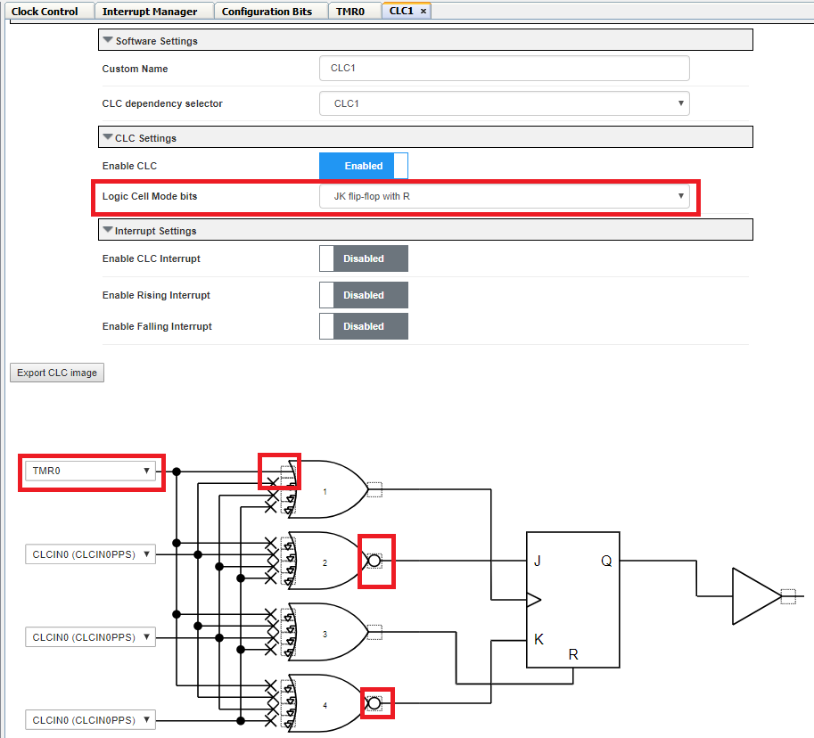
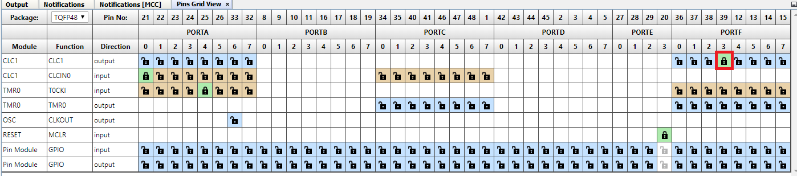

<!-- Please do not change this logo with link -->

# Hello World

This example shows how to configure the TMR0, and CLC on the PIC18F57Q43 Curiosity Nano to blink an LED using drivers in MPLAB Code Configurator (MCC). The example uses the Pin Manager to configure the correct pin to be an output and to provide the correct output voltage for Blinking the LED.

## Related Documentation

- [MPLAB Code Configurator](https://www.microchip.com/en-us/development-tools-tools-and-software/embedded-software-center/mplab-code-configurator)
- [PIC18-Q43 Family Product Page](https://www.microchip.com/en-us/products/microcontrollers-and-microprocessors/8-bit-mcus/pic-mcus/pic18-q43)

## Software Used

- [MPLAB® X IDE](http://www.microchip.com/mplab/mplab-x-ide) **5.45** or newer 
- [MPLAB® XC8](http://www.microchip.com/mplab/compilers) **2.31** or a newer compiler 
- [MPLAB® Code Configurator (MCC)](https://www.microchip.com/mplab/mplab-code-configurator) **4.1.0** or newer 
- [MPLAB® Melody Library](https://www.microchip.com/mplab/mplab-code-configurator) **1.37.24** or newer 
- PIC18F-Q_DFP **1.11.185** or newer Device Pack

## Hardware Used

- [Microchip PIC18F57Q43 Curiosity Nano Evaluation Kit](https://www.microchip.com/developmenttools/ProductDetails/DM164150)

## Setup

MCC with the Melody library was used to implement this example as shown in the following section.
## TMR0 Configuration
In the Device Resources window click the dropdown arrow next to "Drivers" to expand the choices

In the Device Resources window scroll to find "Timer" click the dropdown arrow to expand the choices

In the Device Resources window scroll to find "TMR0" click the green plus symbol to add the driver to the project.

*Device Resources*

In the TMR0 / Easy View select Prescaler of 1:512, Clock Source of FOSC/4, Disable Syncronisation, and type in 0.5 for the requested period which comes out to 500ms. Notice actual period calculated by MPLAB.

## CLC Configuration
In the Device Resources window scroll to find "CLC" click the dropdown arrow to expand the choices

Click the plus symbol on CLC1 to add the CLC module to the project.

For CLC settings select J K flip-flop with R from the dropdown menu. on Gate picture first input select TMR0 for the input to the clock of the J K flip-flop and complete the connecion by clicking on the first input to OR gate 1. click on the output boxes on OR gate 2 and 4 to create a 1 input to the J K flip-flop. This configuration should toggle the output of CLC1_out every time TMR0 rolls over.

*CLC Configuration*

## Pin Configuration
The Pin controlling the onboard LED on the Curiosity Nano board was configured using the Pins Grid View. The Pins Grid View is accessed by clicking on the Pins line in Project Resources.

*Project Resources*

Find CLC1 output the pin connected to the LED, RF3, was selected as an output by clicking the corresponding padlock symbol.

*Pins Grid View*s

## Operation

After having flashed the application to the PIC18F57Q43 Curiosity Nano, the onboard LED Blinks as the application code operates.

## Summary

The example has shown how MCC can be used to easily configure TMR0, CLC module and output pins of the PIC18F57Q43 device. 
